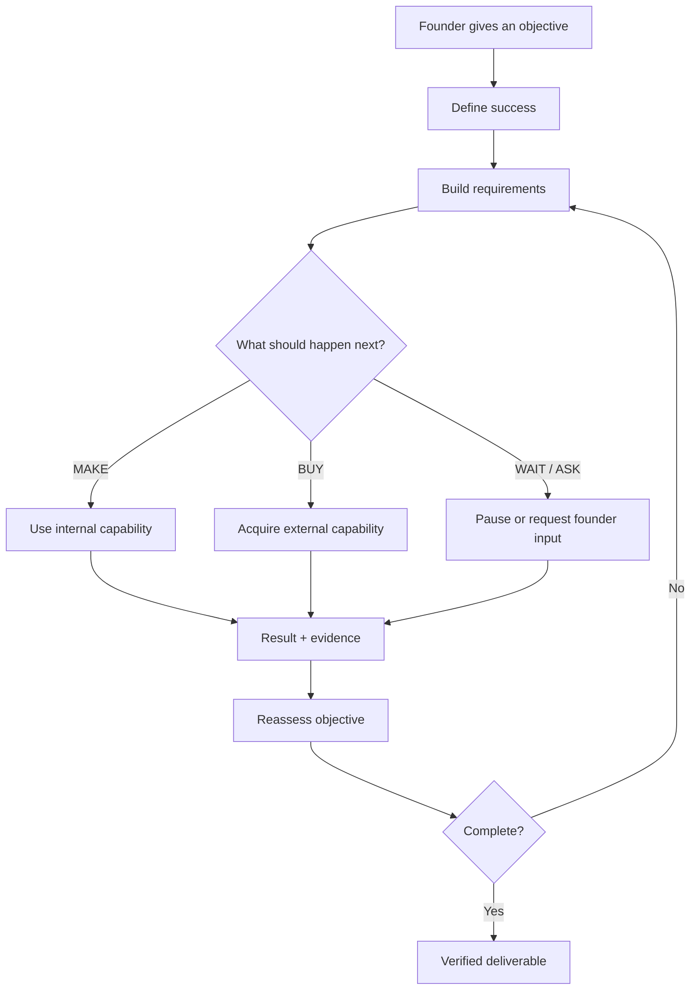
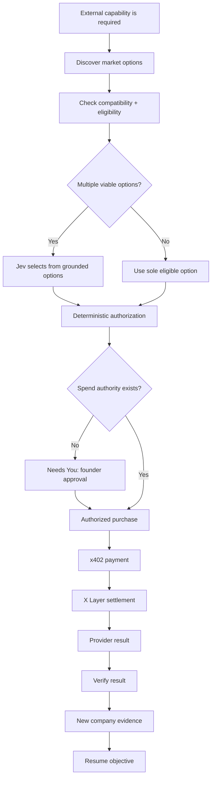
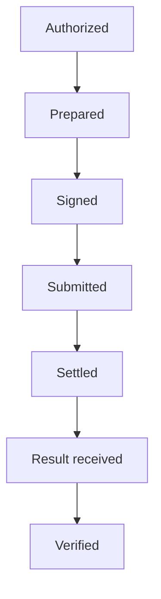
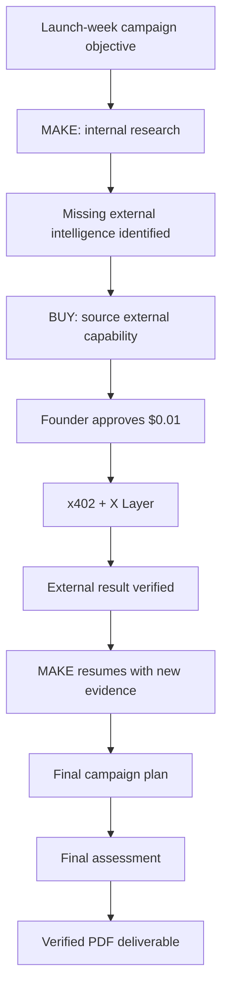
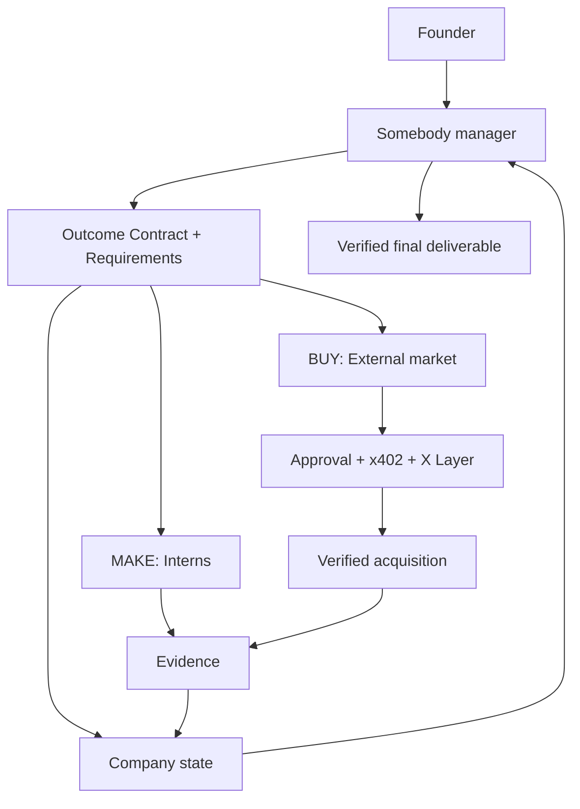
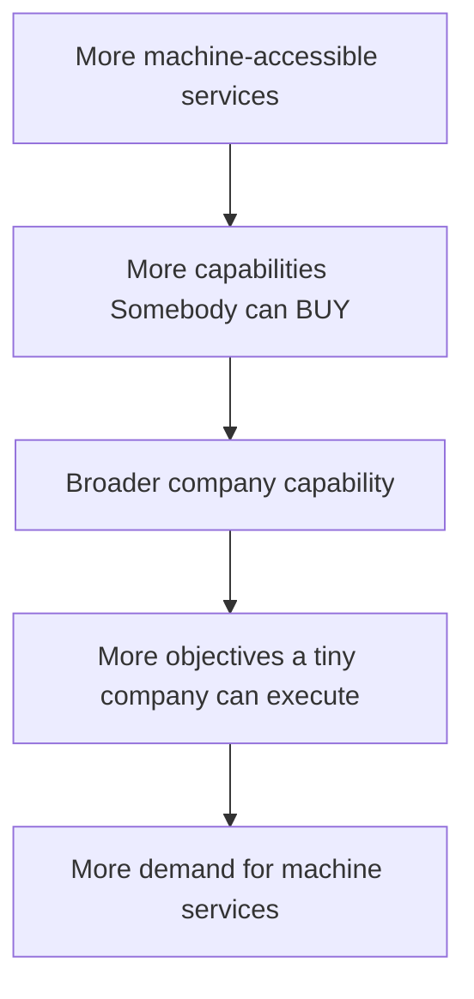

# Somebody × OKX

### The AI manager for the One-Person Company.

**MAKE what your company can. BUY what it can't.**

Give Somebody an objective. It figures out what has to happen, assembles the internal capability the company already controls, acquires what it is missing from outside, asks the founder for authority when money is involved, and keeps managing until there is a verified deliverable.

**OKX Dev Day 2026 · Build a Company**

[▶ Watch the demo](https://youtu.be/q58dwuSw-Gc) · [What we built](BUILD_DELTA.md) · [Architecture](ARCHITECTURE.md) · [Product spec](PRODUCT_SPEC.md)

> **Somebody has to do it. Now Somebody can.**

---

## The thesis: the One-Person Company

AI is making far more knowledge work available inside a very small company. But a company still does not own every capability it needs.

It may need proprietary data, specialist services, infrastructure, access, payments, suppliers, logistics or other external resources.

That creates a familiar company decision:

# MAKE or BUY?

A founder sets the direction.

Somebody becomes the management layer between the objective, the company's internal AI workforce and the external capability market.

As more capabilities become machine-accessible and machine-buyable, a tiny company can gain the functional reach of a much larger organization without the founder personally coordinating every researcher, contractor, SaaS product, supplier and workflow.

**MAKE / BUY is the primitive. The larger vision is an AI-managed company.**

---

## How Somebody works

A chatbot is usually:

**prompt → model → answer**

Somebody works differently:

**objective → requirements → MAKE / BUY decisions → action → evidence → reassessment → verified deliverable**

The founder gives Somebody an **objective**, not a workflow.

Somebody turns that objective into an **Outcome Contract**: a structured definition of what successful completion means. It decomposes that outcome into Requirements and their dependencies, then repeatedly decides what should happen next.

The core loop is:

**Decide → Act → Observe → Decide again**

The LLM reasons. The application controls what is true, what actions are permitted, what money can be spent, what evidence exists and what counts as done.

---

## MAKE: internal company capability

Somebody can create or reuse bounded internal AI workers called **Interns**.

An Intern receives a defined responsibility, controlled tools, assignment-specific context, evidence requirements and completion criteria. It can research, analyze, draft, inspect company information and perform other work available inside the company's governed environment.

Somebody does not hand one enormous prompt to one model and hope the whole company objective comes back complete.

The separation is deliberate:

- **Founder** sets direction and grants authority.
- **Somebody** manages the objective.
- **Interns** execute bounded internal work.

An Intern cannot grant itself financial authority or silently decide that company money should be spent.

---

## BUY: crossing the company boundary with OKX

MAKE only works for capability the company already controls.

When Somebody identifies a genuine external resource gap, the BUY path lets the management loop cross that boundary.

### Where each part fits

**OKX AI** opens the external capability market. Somebody can discover machine-buyable services instead of being hardcoded to one merchant.

**Jev** is a bounded sourcing-selection component. It is used after deterministic eligibility filtering when multiple grounded options remain. It does not replace Somebody's management loop and it does not grant authority.

**Founder approval** creates bounded economic authority when a paid action is required and no matching authority already exists.

**OKX x402** enables the authorized machine-to-machine purchase.

**X Layer Testnet** provides the settlement rail used in the recorded demo.

The important product idea is simple:

> **OKX gives Somebody an external economy.**

Without an external market and transaction rail, Somebody can manage the capability the company already owns. OKX lets it cross that boundary, acquire something the company genuinely lacks, verify it and put the result back to work.

### Inspect the OKX integration

The repository keeps live OKX integration code separate from the controlled Testnet/replay surfaces used for the submission demo.

| Integration seam | Implementation |
| --- | --- |
| OKX AI / Onchain OS service discovery | [`lib/market/okxDiscovery.ts`](lib/market/okxDiscovery.ts) |
| Application bridge into OKX discovery | [`app/api/okx/discover/route.ts`](app/api/okx/discover/route.ts) |
| Verified service mapping, including Newsliquid | [`lib/market/registryData.ts`](lib/market/registryData.ts) |
| Newsliquid provider + confirmed live x402 endpoint contract | [`lib/providers/newsliquid.ts`](lib/providers/newsliquid.ts) |
| Official Onchain OS / Agentic Wallet payment executor | [`lib/payment/onchainOsExecutor.ts`](lib/payment/onchainOsExecutor.ts) |
| x402 v2 interoperability handling | [`lib/payment/x402V2Compat.ts`](lib/payment/x402V2Compat.ts) |
| X Layer Testnet settlement verification | [`lib/payment/xlayerSettlement.ts`](lib/payment/xlayerSettlement.ts) |
| Controlled Testnet marketplace used in the demo | [`lib/market/testnetDemoMarket.ts`](lib/market/testnetDemoMarket.ts) |
| Social Media Guru controlled provider adapter | [`lib/providers/socialMediaGuru.ts`](lib/providers/socialMediaGuru.ts) |

The live discovery path uses the official `onchainos agent service-match` interface. The demo-specific market is intentionally separate and explicitly marked as controlled Testnet data, so the replay does not masquerade as a fresh live marketplace call.

---

## Financial authority stays with the founder

Autonomous does not mean unlimited authority.

When Somebody wants to make a purchase and does not already have sufficient founder-granted authority, it stops and surfaces **Needs You → Approve**.

The founder approves a bounded economic action. The payment layer then executes the already-authorized intent.

The demo uses a **$0.01 acquisition**, but the important part is the trust boundary:

**the agent cannot silently give itself money.**

---

## Payment is a lifecycle, not a `success: true`

A machine-to-machine purchase is not treated as one API call.

Somebody distinguishes the stages of economic execution:

A submitted transaction is not automatically settled.

A settled transaction does not automatically mean the merchant delivered a valid result.

The external result must still be received and verified before Somebody can trust it as company evidence.

---

## Demo: one objective, both MAKE and BUY

[▶ **Watch the recorded demo**](https://youtu.be/q58dwuSw-Gc)

The demonstrated objective is:

> **Build a launch-week social media campaign for Somebody.**

The run was configured to expose both MAKE and BUY in one compact objective.

In the run, Somebody:

1. defines the outcome and Requirements;
2. assigns work the company can already do to an Intern;
3. identifies a genuine missing external resource;
4. evaluates external options;
5. requests founder approval for the bounded purchase;
6. executes the x402 payment and observes settlement on X Layer Testnet;
7. retrieves and verifies the provider result;
8. writes the acquisition back into company evidence;
9. resumes internal work using the newly acquired information;
10. verifies the final deliverable against the original completion bar;
11. exports the accepted artifact as PDF.

The most important sequence is:

**MAKE → discover a gap → BUY → verify → MAKE again**

The purchase is not the objective. It is one justified action inside a longer management process.

> **The transaction serves the objective. The objective does not exist to demonstrate a transaction.**

---

## Demo scope

The demonstrated **Social Media Guru** is a controlled synthetic Testnet provider. It does **not** represent live TikTok, Instagram, Facebook or X production data.

Its service pattern is based on machine-buyable merchants already available through OKX AI, such as **Newsliquid**, which offers granular pay-per-call market and social intelligence services.

The controlled provider gives the submission a repeatable external-capability gap while preserving the real architectural path:

**resource gap → market discovery → sourcing decision → founder authority → machine purchase → X Layer settlement → result verification → downstream reuse**

The recorded submission uses a completed controlled run/replay so the full path can be shown reliably. The underlying engine itself is generic: it is not intrinsically scripted to choose MAKE first and BUY later.

Official OKX reference: [From Code Runs to Security Scans: OKX AI’s Agent-to-Agent Marketplace Takes Shape](https://www.okx.com/en-eu/learn/okx-ai-2)

---

## What was built during OKX Dev Day

Somebody existed before this hackathon. The starting project already had bounded agent execution, persistent operational state, evidence tracking, human approvals, external-effect verification and a procurement-oriented product foundation.

The OKX build turned that foundation into a generic managerial and economic system.

| Before | Somebody × OKX |
| --- | --- |
| Role-specific operational workflow | Generic objective manager |
| Role-specific success/completion | Outcome Contract + requirement graph |
| Bounded agent runtime | Dynamic reusable internal workforce |
| No general MAKE / BUY primitive | Per-requirement MAKE / BUY / HYBRID / WAIT / ASK |
| Provider-specific integrations | Discoverable external economic options |
| Human approval patterns | Product-level bounded spend authority |
| External effects | Explicit x402 purchase + settlement + result lifecycle |
| No general purchased-capability loop | Verified acquisition feeds downstream MAKE |
| Role-specific result | Terminal deliverable + semantic assessment |
| No general report export | Verified founder-ready PDF |
| Workflow-oriented UI | Objective-centered company workspace |
| Model-specific fragility | Hardened structured boundaries and portability work |

See [BUILD_DELTA.md](BUILD_DELTA.md) for the complete feature-by-feature delta and use the repository commit history as implementation evidence.

---

## How this maps to the OKX judging criteria

OKX states that projects are assessed holistically on **innovation, product completeness, user value, technical execution, meaningful integration with X Layer and/or OKX AI, growth potential and contribution to the OKX ecosystem**.

| Judging criterion | Evidence in Somebody |
| --- | --- |
| **Innovation** | Somebody treats company execution as an ongoing managerial problem: objective → requirements → dynamic MAKE/BUY decisions → evidence → reassessment, rather than a one-shot agent invocation. |
| **Product completeness** | The demonstrated flow runs from founder objective through internal work, resource-gap detection, sourcing, approval, payment, settlement, result verification, resumed work, final assessment and PDF deliverable. |
| **User value** | The founder sets direction and retains consequential authority while Somebody takes responsibility for coordinating the work required to reach the outcome. |
| **Technical execution** | Persistent company state, bounded workers, explicit authority boundaries, deterministic eligibility and authorization, durable payment states, result verification and version-bound completion are implemented as separate concerns. |
| **Meaningful OKX integration** | OKX is the BUY path: external capability discovery and machine-to-machine payment on X Layer materially change what the company can do and feed new capability back into the objective. |
| **Growth potential** | Every additional machine-accessible service expands the capability set Somebody can assemble around a founder objective. MAKE/BUY generalizes beyond the demonstrated research purchase. |
| **OKX ecosystem contribution** | Somebody can act as a demand-side orchestration layer for the agent economy: determine when outside capability is needed, discover relevant services, obtain authority, purchase them and put their outputs to work. |

Official criteria: [OKX Dev Day 2026 Builder Kit](https://www.okx.com/fr-fr/learn/okx-dev-day-builder-kit)

---

## Technical architecture

Somebody is a persistent AI manager operating over durable company state.

### System layers

- **Product interface** — Next.js / React founder workspace.
- **Company state** — Convex persists objectives, requirements, workers, decisions, approvals, execution intents, evidence, acquisitions, artifacts and assessments.
- **Manager** — LangGraph coordinates the repeating management loop.
- **Internal workers** — OpenAI Agents SDK executes bounded assignments.
- **Decision layer** — application logic builds eligible MAKE / BUY / HYBRID / WAIT / ASK / BLOCK options.
- **Sourcing selection** — Jev can select among multiple grounded eligible choices.
- **External economy** — OKX AI services, x402 and X Layer provide discoverable and executable external capability.
- **Completion** — current artifacts are assessed against the objective's completion bar before the objective is accepted as done.

For the full system design, see [ARCHITECTURE.md](ARCHITECTURE.md).

---

## Tech stack

| Layer | Technology |
| --- | --- |
| Web application | Next.js 16, React 19, TypeScript |
| Product state / backend | Convex |
| Management loop | LangGraph |
| Internal worker runtime | OpenAI Agents SDK |
| Model access / routing | OpenRouter |
| Models exercised during development | GPT-6 Luna; Nex AGI N2.5 Mini |
| Structured sourcing selection | Jev |
| Jev transport | Vercel AI Gateway |
| External capability market | OKX AI |
| Machine payments | OKX x402 packages |
| Settlement network | X Layer Testnet |
| Merchant service | Express |
| Validation / contracts | Zod |
| PDF export | pdf-lib |

The orchestration layer is designed around bounded structured interfaces rather than one model-specific prompt path. Multiple model families were exercised during development; the recorded submission uses the validated demo configuration rather than claiming identical behavior across every model.

---

## Why this can become much bigger

Today the demonstrated BUY is a piece of external intelligence.

The same management primitive can extend to other machine-accessible capability:

- another specialist agent;
- proprietary data;
- compute;
- software or APIs;
- quotations;
- infrastructure;
- supplier services;
- bookings;
- logistics;
- physical-world services.

Those actions can be chained around one objective.

This creates a useful relationship with an agent marketplace:

**developers supply capability; Somebody creates objective-driven demand for it.**

One transaction is just the beginning.

---

## Repository guide

- [BUILD_DELTA.md](BUILD_DELTA.md) — what existed before OKX and what was built during the hackathon.
- [PRODUCT_SPEC.md](PRODUCT_SPEC.md) — current product behavior and capability model.
- [ARCHITECTURE.md](ARCHITECTURE.md) — end-to-end system architecture.
- [DECISIONS_LOG.md](DECISIONS_LOG.md) — accepted product and architecture decisions.
- [DESIGN.md](DESIGN.md) — founder-facing product experience and visual system.
- [docs/DEMO.md](docs/DEMO.md) — recorded demo flow and scenario.
- [docs/DEVELOPMENT.md](docs/DEVELOPMENT.md) — local setup, commands and development workflow.

---

## Product principle

**The objective creates demand. Somebody assembles the company around it.**
