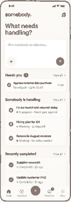
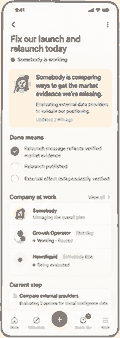
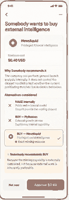

# M5 Mobile Design Direction — Somebody

Status: **PROVISIONALLY ACCEPTED — founder review 19 September 2026**  
Scope: product/design direction only; not production implementation.  
Reference base for this branch: feat/m4-management-engine @ 7723c096f58067c79a59782792ec4346184df1f4.

## 1. Core recommendation

Do **not** shrink the web Mission Control into a phone.

The mobile product should be:

> **Somebody Mobile = the founder's command remote.**

The founder gives Somebody an Objective, walks away, sees what is being handled, intervenes only when authority or judgment is genuinely required, and inspects the causal story when needed.

The mobile experience should emphasize:

**Now / Needs You / Outcome**

The web surface can carry more spatial theatre. Mobile should be ruthless about attention, authority and legibility.

## 2. Research basis

Mobbin patterns used as references:

- Manus home / task creation: https://mobbin.com/screens/076c5495-0a54-467a-82ea-defe2c64c016
- Manus task detail: https://mobbin.com/screens/93c26b4c-c849-43ca-946b-1a3901ddff41
- Linear Mobile issue detail: https://mobbin.com/screens/df737887-4c3a-4cb5-9d50-aee993cad6a3
- Linear Mobile inbox: https://mobbin.com/screens/97e4122c-fb36-414e-8f11-da31e1a8aebc
- Revolut Business approval: https://mobbin.com/screens/9a34e3c2-65fa-49e0-9a6f-5833c749d333
- Airwallex approval/task detail: https://mobbin.com/screens/64c52224-dd85-4916-a31d-97a03c55a5c1

Transferable lessons:

- Manus: autonomous work should feel like a persistent task/object, not only a chat thread.
- Linear Mobile: dense operational state can remain scannable when hierarchy is disciplined.
- Linear Inbox: mobile is naturally strong as a filtered attention queue.
- Revolut Business and Airwallex: authority and money decisions should become explicit structured approval surfaces, not conversational “shall I continue?” prompts.

Do not visually clone any of them. Adapt their interaction logic to Somebody's product model.

## 3. Mobile information architecture

Recommended bottom-level navigation:

- **Home**
- **Objectives**
- **Needs You**
- **More**

A prominent create-objective action remains persistent.

Do not give That Guys, transactions, marketplace, evidence or providers their own primary tabs. Those are subordinate system objects under an Objective.

The founder's mobile questions are simpler:

- What did I ask?
- What is Somebody handling?
- What needs me?
- What happened?
- Are we done?

## 4. Key screens

### Screen 1 — Home

Purpose: delegation and fast status.

The top action is not “start a chat”; it is “give Somebody something to handle.”

Below the composer:

- Needs You;
- Somebody is handling;
- Recently completed.

The primary record is an Objective, not a conversation thread.

### Screen 2 — Live Objective

Purpose: answer “what is Somebody doing right now?”

Top hierarchy:

- Objective;
- current mission state;
- Somebody Now;
- Done means / Outcome Contract;
- compact Company at work;
- Current step.

The web Living Company map becomes a vertically legible company-state section rather than a pan/zoom graph.

Show Somebody, That Guys and Somebody Else providers with role/state labels.

### Screen 3 — Needs You

Purpose: founder attention queue.

This is not a generic notification centre.

Only elevate things that actually require authority, judgment or intervention:

- approval;
- material ambiguity;
- ASK / one founder answer;
- BLOCK / access or policy issue;
- unsafe or unsupported action;
- material budget exception.

Do not notify the founder merely because normal work progressed.

### Screen 4 — Approval / Managerial Decision

Purpose: make authority feel deliberate and safe.

Treat this more like a Revolut/Airwallex business approval than an AI chat prompt.

Show:

- exact requested action;
- provider/resource;
- maximum cost or authority boundary;
- why Somebody recommends it;
- alternatives considered;
- why rejected options lost;
- selected option;
- clear Not now / Approve action.

For a BUY decision, make the difference between internal capability and externally controlled capability explicit.

### Screen 5 — Mission Story

Purpose: causal observability without event-log noise.

Show only meaningful state transitions, for example:

- That Guy reused;
- artifact changed;
- new Requirement discovered;
- Somebody chose BUY;
- evidence arrived;
- worker changed course;
- ready to publish;
- effect submitted;
- effect verified.

Do not show model calls, orchestration-node spam, retries that changed nothing or raw tool traces in the founder view.

### Screen 6 — Completed

Purpose: close the Objective with proof and honest uncertainty.

Show:

- resolved / not resolved;
- what was achieved;
- evidence-backed results;
- what remains uncertain;
- useful follow-up actions.

The completion screen must feel like a closed managerial case, not a final chatbot message.

## 5. MAKE vs BUY on mobile

Use a pushed detail screen or bottom sheet.

Each option should be vertically comparable:

- strategy;
- candidate;
- capability/resource supplied;
- eligibility or rejection reason;
- cost when relevant.

Example:

MAKE internally  
Public web + internal model  
Rejected for exact privileged-data need.

BUY — generic growth wrapper  
Rejected because it duplicates internal capability.

BUY — Newsliquid  
Selected because it supplies the exact externally controlled resource.

Somebody's recommendation should be explained in business terms, not hidden reasoning.

## 6. Mobile System X-ray

Do not port the full desktop graph onto a phone.

Use a vertical causal drill-down instead:

Objective  
↓  
Requirement  
↓  
Somebody decision  
↓  
That Guy / Somebody Else  
↓  
Evidence or effect  
↓  
Verification  
↓  
Outcome level

Each object can be tapped for detail.

This preserves causal observability without tiny nodes or awkward pan/zoom interaction.

## 7. Push notification model

Mobile becomes compelling when Somebody can disappear into the background.

Good notification:

> Somebody needs you  
> I can get the market evidence we're missing for up to $0.40.

Bad notification:

> Growth Operator completed step 4.

Notify on founder-required authority or genuinely material state only.

A strong mobile demo is:

1. founder gives Objective;
2. phone is put away;
3. Somebody works autonomously;
4. approval push arrives;
5. founder approves;
6. later a second external-effect approval arrives if needed;
7. final push says Objective resolved and independently verified.

This expresses delegated management more naturally than keeping the founder watching a live agent.

## 8. Motion and presentation

Mobile motion should be quieter than web.

Use motion only for:

- Somebody actively working;
- a state changing;
- evidence/resource arrival;
- approval attention;
- verified lock/resolution.

Avoid continuous decorative animation.

Respect reduced-motion preferences.

## 9. Web vs mobile jobs

**Web**

> “I can see the company assembling and operating around my Objective.”

Best for:

- demo theatre;
- rich causal inspection;
- compact company map;
- deeper System X-ray.

**Mobile**

> “I delegated this to Somebody, walked away, and it came back only when it actually needed me.”

Best for:

- Objective delegation;
- current-state checks;
- founder attention;
- approvals;
- push-driven management;
- result review.

These should share product truth and read models, but they do not need identical layout.

## 10. Production mapping

Suggested mobile mappings:

- Home Objective rows ← objective summary + current control status;
- Needs You count/list ← authoritative approval / ASK / BLOCK / ambiguity queue;
- Live Objective ← Objective + Outcome Contract + current bounded action;
- Company at work ← Worker identity/assignment + selected external provider state;
- Approval ← deterministic authorization verdict + grounded decision/options + spend/authority bound;
- Mission Story ← normalized causal ActivityEvents;
- Completed ← deterministic completion gate + verified evidence + unresolved supporting work/uncertainty.

Push notifications must derive from authoritative founder-attention events, not arbitrary model text.

## 11. Explicitly do not do

- do not make mobile a compressed desktop dashboard;
- do not make the product a chat-history list;
- do not port the full System X-ray graph as the main phone interaction;
- do not notify on every worker/tool event;
- do not ask “shall I continue?” when a structured approval is required;
- do not expose chain-of-thought;
- do not claim purchase, publish or completion before the corresponding authoritative state exists;
- do not give implementation objects their own top-level tabs without a founder use case;
- do not use fake percentage progress;
- do not let visual motion imply runtime truth.

## 12. Provisional status

This direction is accepted provisionally for future product planning.

It does not authorize mobile implementation now, and it does not require the hackathon demo to ship both web and mobile. The web and mobile directions may be implemented independently or together later, provided both consume the same authoritative management truth.
