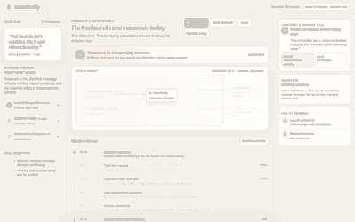

# M5 Web Surface Brief

Status: **PROVISIONALLY ACCEPTED — 19 September 2026**  
Scope: design/implementation brief only; no production integration is authorized by this document.  
Reference base for this branch: feat/m4-management-engine @ 7723c096f58067c79a59782792ec4346184df1f4.

## Purpose

Build the desktop/laptop Somebody surface so a founder can understand, within seconds, that Somebody is an accountable AI manager rather than a chat assistant.

The core product idea is:

> The Objective creates demand; Somebody assembles the company required to satisfy it.

The interface must combine operational clarity with theatrical observability. The theatre must always correspond to product-known state.

## Primary experience

The founder gives an Objective. The surface then makes clear:

- what Somebody believes success means;
- what is happening now;
- which That Guys are working, waiting, reused or newly created;
- which Requirements exist;
- which important managerial decisions were made;
- when Somebody is considering MAKE, BUY, HYBRID, WAIT, ASK or BLOCK;
- when external capability or evidence crosses the company boundary;
- what requires founder authority;
- what changed because of new evidence;
- whether the Objective is actually resolved;
- what remains pending or uncertain.

Do not turn this into a chat transcript, project-management board, raw event log or developer observability console.

## Chosen structure

Use **Executive Mission Control** as the default founder surface, with a small **Living Company** layer and a secondary **System X-ray**.

Desktop target: approximately 1440 × 900.

Primary hierarchy:

1. Objective and Outcome Contract.
2. Somebody Now — the strongest single sentence on current managerial state.
3. Compact company field showing Somebody, internal That Guys and external Somebody Else providers.
4. Mission stream containing only founder-meaningful causal events.
5. Human-attention rail for approvals, ASK, BLOCK and material ambiguity.
6. Inspector for progressively disclosed detail.
7. Secondary System X-ray for deeper causal structure.

## Layout

### Left rail

Keep the founder Objective persistent.

Show the Outcome Contract in human language and discrete outcome levels such as Achieved, Current, Pending and Not proven.

Do not invent percent-complete unless the domain truth genuinely supplies one.

### Centre

The centre is the live mission.

The Somebody Now strip should state the current managerial action in plain language.

The company field should show an internal boundary. That Guys live inside it. External services remain outside it. Evidence or resources may visibly cross the boundary only when the runtime has a corresponding state change.

The Mission Stream sits below or alongside this field and tells the causal story.

### Right rail

This is the human-attention and inspector zone.

When authority is required, the approval/request should dominate the rail rather than being buried in history.

Otherwise show Somebody's current call, relevant evidence and selected-object detail.

## Key interaction states

The UI must remain coherent across:

- interpreting;
- working;
- waiting;
- approval required;
- ASK / founder input required;
- blocked;
- external acquisition pending;
- evidence arrived;
- worker reacted;
- external execution pending;
- verification pending;
- resolved;
- failed safely.

A state must not look broken merely because the correct action is WAIT, ASK or BLOCK.

## Managerial decisions

MAKE / BUY / HYBRID and worker REUSE / CREATE decisions should be easy to understand at a glance.

Expose rejected options only through progressive disclosure.

For spending or authority decisions show:

- what Somebody wants to do;
- why it is needed;
- alternatives considered;
- maximum cost or authority boundary;
- the exact founder action requested.

Do not expose chain-of-thought.

## Motion semantics

Motion is presentation of known state, never independent truth.

- active work: restrained pulse/travel;
- waiting: slower, quieter motion;
- approval required: affected path pauses and founder attention becomes dominant;
- blocked: static;
- external evidence arriving: one directional boundary-crossing transition;
- artifact/effect changed: brief settle/change treatment;
- verified: stable lock/check;
- resolved: overall field calms.

Respect reduced-motion preferences.

## System X-ray

The X-ray is secondary, not the default operating surface.

It may show the causal chain across:

Objective → Outcome Contract → Requirements → worker assignments → managerial decisions → external providers → evidence/effects → verification.

Do not show implementation-level LangGraph nodes such as observe, reduce, decide or settle as product objects.

## Demo choreography

The canonical demo should visibly support:

1. Objective received.
2. Success interpreted into an Outcome Contract.
3. Existing That Guy reused or a new one created.
4. Internal work changes an artifact/state.
5. A missing Requirement emerges.
6. Somebody compares internal and external options.
7. A BUY path is chosen because the missing capability is externally controlled.
8. Founder approval becomes the primary action if needed.
9. External resource/evidence arrives.
10. Internal worker visibly reacts.
11. An external execution Requirement appears.
12. External execution is authorized and performed.
13. Independent verification arrives.
14. Minimum completion bar is satisfied.
15. Somebody reports achieved, pending and uncertain items.

The launch scenario is demo data, not architecture.

## Production mapping

The production UI should consume normalized founder-facing read models.

Suggested mappings:

- Objective header ← Objective + management state;
- Outcome rail ← Outcome Contract + Outcome Levels + completion verdict;
- requirements ← governed Requirement projections;
- Somebody Now ← current control summary and bounded action;
- That Guys ← persistent Worker identities + active assignments;
- sourcing decision ← ManagerialDecision + grounded options + deterministic authorization verdict;
- approval ← application-owned authority/spend verdict;
- external boundary ← AuthorizedExecutionIntent + provider lifecycle;
- evidence ← verified Evidence/provider results;
- artifact/effect change ← CompanyArtifact/effect state;
- mission stream ← normalized durable ActivityEvents;
- final status ← deterministic completion gate + unresolved required/supporting Requirements.

The renderer must never infer truth from animation, position or visual adjacency.

## Truth and safety

Prototype or demo content must never imply that a real payment, provider result, publication, blockchain confirmation or Objective completion occurred unless the production runtime actually proves it.

Distinguish prepared, approved, submitted, settled/result-received and independently verified states.

## Acceptance criteria

The web surface is acceptable when:

- the Objective and current state are obvious within seconds;
- approval requests are impossible to miss;
- the founder can answer “why did Somebody do that?” without seeing hidden reasoning;
- persistent worker reuse is legible;
- internal vs external capability is visually clear;
- Cutoff 2 WAIT / ASK / BLOCK states look intentional;
- the System X-ray is optional;
- motion remains semantic and restrained;
- the surface works without scenario-specific hardcoding;
- nothing in the UI claims stronger runtime truth than the backend provides.

## Reference screenshots

